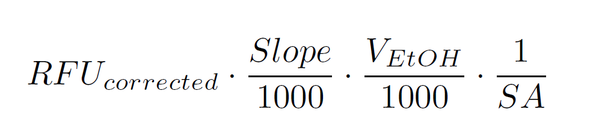

```{r setup, include=FALSE}
knitr::opts_chunk$set(echo = TRUE)

```

add dates & add when to update the samplelist on your local machine 

## Introduction

Converting between chlorophyll-a (chl-a) raw units (rfu) and mg/m^2^ for the Hubbard Brook Experimental Forest long-term algal record

To do this calculation, you need these five things: 

* The `samplinglist_updated.xlsx` file (sample ID, sampling date, substrate, and watershed, or weir)
* The raw chl-a units (rfu) file with: a) rfu, b) volume of EtOH, c) sample ID, and d) chl-a run number
* The standard curve slope ID and information in `chla_standardcurve_summary.csv`
* the surface areas of the substrates 

In general, the calculation will, first, merge the raw data with the sample listing file that contains IDs. Second, it will subtract average blank values from each run. Third, it will calculate chl-a in mg/m^2^ using the slope of the standard curve, the volume of EtOH, and the surface area of the substrates. 

### Ready to Start?
*We strongly recommend downloading this code from github* so that you have a copy of the folder structure and source files on your computer. 
- You can clone this repository through a) [SSP/HTTPS](https://docs.github.com/en/get-started/getting-started-with-git/about-remote-repositories) or b) by downloading a zip folder. If downloading, make sure to put the [hbwater_chla](https://github.com/audreythellman/hbwater_chla) folder where you want it to live on your computer. For example, my `hbwater_chla` folder is a sub-folder within my `_HBEF` research folder on my computer.

Open up a new R script within `hbwater_chla` and follow the steps. We recommend opening the `*.Rproj` file because it will automatically create the correct **working directory** 

Once you have the Rscript open in the hbef_chla project, we can load or download our packages:

``` {r setup2, message = F, warning = F}

# add packages 

library(googledrive)
library(tidyverse)
library(lubridate)
library(readxl)
library(data.table)
library(viridis)

`%notin%` <- Negate(`%in%`)

```

Make sure to `install.packages()` that are not loaded onto your machine. Finally, this script uses Google Drive. Let's authorize `tidyverse` to have access to our files. When prompted, check "see, edit, create, and delete all of your Google Drive files"


Check that `googledrive` is properly set-up by running this code: 

```{r setup3, results = 'hide', message= F, warning=F}
drive_find(n_max = 30)
```

If it runs, you should get a list of recently opened files on your Google Drive & their link `id`; this is how we will temporarily download files from Google Drive to use in our script. 


## Step 1: manually input data

First, manually clean your data. Five items are needed for calculation: 

1) the rfu data frame
2) the standard blank data frame
3) surface area calculations from imageJ
4) a slope estimate
5) the sample list. 

- ~~*Note: the HB WaTER slope from the 2018 standard curve is: 0.2317*~~ [discontinued]
- *Note: the HB WaTER slope information for samples run in 2019+ can be found at `raw data/chla_standardcurve_summary.xlsx`*
- *Note: the raw data for each year are located in `1_Algae/Data/raw data/Chla- raw run files`*

We recommend downloading a copy of the data and formatting the new data in the same way (see: [2020 RFU](https://docs.google.com/spreadsheets/d/1upnEjjn9tV2HmHWzrN-PuQlx7YOTkYBg/edit?usp=sharing&ouid=114138765499543876405&rtpof=true&sd=true))

If you are not a HBWaTER user, use the raw file in the `demo/` folder and skip to **STEP 2**. To use the function as is, we recommend uploading this demo file to Google Drive. Otherwise, change part of the `get_chla_data_fr_drive` function. 

- *Note: each of the different data frames are saved as three different excel sheets labeled: rfu, blanks, & sa.*
- *Note: the formatting for this file name is: hbwtr_chla_rfu_YEAR.xlsx*

Re-upload this newly formatted data to the `input data` sub-folder in `1_Algae/Data/` folder. The next steps pull from the Google Drive uploaded data. 

Next, you are going to update **your local copy** of `samplinglist_updated.xlsx` in the `hbwater_chla` folder. *You can find updated sampling listing from the year files in `_Sample Listing` on the HB WaTER Google Drive.*

Now that you've:

1) compiled a file with the name `hbwtr_chla_rfu_YEAR.xlsx`
2) uploaded that file to Google Drive
3) updated the *local copy* of `samplinglist_updated.xlsx`

you are ready to move on to the next steps!


## Step 2: programatically clean data

We are ready to clean our data and check compatibility with our calculation code chunk! First we are going to locate & load the data. This code chunk finds the shared drive ID: `shared_drive_find(n_max = 30)`. Because I only have one shared drive, I entered `1` in the `shared_ID` argument. 

```{r locate data, results = 'hide'}
shared_drive_find(n_max = 30)
shared_ID <- shared_drive_find(n_max = 30)[1,]$id

drive_find(pattern = "input data", n_max = 30, shared_drive = shared_ID) #find this data file
```
This above code chunk will give you the `id` of the `input data` folder that we will use to extract `hbwtr_chla_rfu_YEAR.xlsx` from Google Drive. 

Copy this `id` to the clipboard and run the following code: 

```{r locate data 2, include = F}
(input_data_folder <- drive_ls(as_id("1ibElj1bAwB0Nv_XfCv7HL3K6vg1g7mkG"))) #this is the ID for the folder
```

```
  (input_data_folder <- drive_ls(as_id("INSERT COPIED id IN QUOTES")))

```
From here, you will get a list of the input files. Remember the number of the file you are going to clean. In this case, we are going to clean file #2 corresponding to 2020 demo data. 

To clean the data, run this chunk of code: 

```{r clean funtion}
get_chla_data_fr_drive <- function(fileno, sa) {
  #fileno <- 3
  
  temp <- tempfile(fileext = ".xlsx")
  dl <- drive_download(
    as_id(input_data_folder[fileno,]$id), path = temp, overwrite = TRUE)
  
  rfu <- read_excel(temp, sheet = "rfu", col_types = c("text",
                                                       "numeric",
                                                       "numeric", 
                                                       "text", 
                                                       "numeric",
                                                       "text", 
                                                       "text"))
  blanks <- read_excel(temp, sheet = "blanks")[1:4]
  
  if(sa == TRUE) {
    sa <- read_excel(temp, sheet = "sa", col_types = c("text",
                                                        "text", 
                                                        "numeric",
                                                        "numeric", 
                                                        "numeric", 
                                                        "text", 
                                                        "numeric", 
                                                        "text"))
  }
  else {
    sa <- read_excel("./raw data/substrate_surfaceareas.xlsx")[1:4]
  }
  
  samplinglist <- read_excel("./raw data/samplinglist_updated.xlsx", col_types = c("date", 
                                                                                   "text", 
                                                                                   "text", 
                                                                                   "text"))
  #max(samplinglist$DATE) #NOTE THIS IS LAST DATE ENTERED 
  
  chla_rfu <- list(rfu,blanks,sa,samplinglist)
  names(chla_rfu) <- c("rfu",
                       "blanks",
                       "sa", 
                       "samplist")
  
  print(paste("NOTE: the last date entered in the sampling list is", max(samplinglist$DATE)))
  return(chla_rfu)
  
}
```
*This function pulls down the data, formats it, and adds it to the R global environment*

Next, run this function on your file number and save as `chla`, set surface area (`sa = TRUE`) for all files after 2020: 
```{r function out, results = 'hide', message = F}
chla <- get_chla_data_fr_drive(1, sa = TRUE)
```
*The function will tell you what your last date entered is & the file you downloaded. Be sure this is a later date than the last chl-a value ran & the correct file*

To check column compatibility (format check), your column names must match:

```{r check cols}
#visually inspect columns 
colnames(chla[["rfu"]])
colnames(chla[["blanks"]])
colnames(chla[["sa"]])
colnames(chla[["samplist"]])
```

_If the columns don't match, manually change them and re-add your files to **Google Drive**; the Notes should be capital in file 1, and notes should be lowercase in file 3 and 4_

## Step 3: check for errors and duplicates 
In the next steps, we will: 

1) check that your sample ID's match between `rfu` and `samplinglist` 
2) check if there are any duplicate values in `rfu`
3) check if there is any missing data based on `SampleIDs` in `samplinglist`

This will identify values that are duplicated:
```{r merge-prep data}

(dups <- chla[["rfu"]]$SampleID[which(duplicated(chla[["rfu"]]$SampleID))]) 

```
This will help you visually ID columns that are duplicated:
```{r mp data}
chla[["rfu"]] %>% filter(SampleID %in% dups) 
```
This will tell you if any of your samples are mislabeled: 
```{r mp data2}

chla[["rfu"]]$SampleID[which(chla[["rfu"]]$SampleID %notin% chla[["samplist"]]$SampleID)] 
```

If any of the above show as duplicates, try to resolve this issue manually in Google Drive and restart from **Step 2**. 

Next, check if there are any missing data using the following function. Input the year that you are checking in the second line (e.g. if `hbwtr_chla_rfu_2020.xlsx` then type `2020`). The `demo` data is from 2021. 

```{r missing data, eval = F}

missing_data_check <- function(year) {
 # year <- 2020
  sub_year <- substr(year,3,4)
  year_samps <- 
    chla[["samplist"]]$SampleID[which(grepl(sub_year, substr(chla[["samplist"]]$SampleID,1,4)))]
  
  print(paste(year_samps[which(year_samps %notin% chla[["rfu"]]$SampleID)], 
              "is missing from the RFU run sheet"))
}

missing_data_check(2021) #the demo is missing data, so there will be a lot of missing data here; but complete years should have few instances of missing data

```

Now your data should have the required columns of a) rfu value, b) substrate, c) date, d) weir, and e) sampling ID which will give you substrate, date, and weir and we are ready to calculate chla to mg/m^2^. 

## Step 4: convert from rfu to mg/m^2^

To covert from rfu to mg/m^2^ we use the following equation: 


```{r echo = F, include = F}
## $$RFU_{corrected} \cdot \frac {Slope}{1000} \cdot \frac {V_{EtOH}}{1000}\cdot \frac {1}{SA}$$
```

where `RFU` is the raw units (corrected by subtracting the average of the blanks), `Slope` is the standard slope  (`rfu/(ug/L)`), `V` is the volume of ethanol (mL) and `SA` is the surface area (`m^2`). 

The following loads the function, which is a function of the chla_list (should be `chla`) and the slope, found using the standard curve or slope ID (`slp_id`): 
```{r get function}
rfu_to_mgm2 <- function(chla_list, slp_id) {
  
  #remember to comment out 
  # chla_list <- chla
  # slp_id <- "Duke2023"
  
  slp_summary <- read_excel("./raw data/chla_standardcurve_summary.xlsx")

      #then remove duplicates
      dups <- chla[["rfu"]]$SampleID[which(duplicated(chla[["rfu"]]$SampleID))] 
      #this will identify values that are duplicated 
      #chla_duplicated <- chla[["rfu"]] %>% filter(SampleID %in% dups) 
      #this will help you visually ID columns
      chla_filtered <- chla[["rfu"]] %>% filter(SampleID %notin% dups) #remove duplicates
      
      chla_wID <- left_join(chla_filtered, chla[["samplist"]], by = "SampleID")
      chla_wID$weir <- as.factor(substr(chla_wID$`WEIR-REP`, 1, 2))
      chla_wID$rep <- as.factor(substr(chla_wID$`WEIR-REP`, 4, nchar(chla_wID$`WEIR-REP`)))
      
      if (year(chla_wID$DATE)[1] >= 2020) {
        
        moss_sa <- chla[["sa"]] %>%
          mutate(height_m = 0.0254) %>% 
          mutate(two_side_sa = 2*height_m*length_m) %>%
          group_by(SampleID) %>% 
          summarise(surface_area = 2*prod(length_m) + sum(two_side_sa))
        
        chla_wsurface <- left_join(chla_wID, moss_sa, by = "SampleID")
      }
      
      if (year(chla_wID$DATE)[1] == 2018) {
        moss_sa <- chla[["sa"]] %>% filter(subs_code == "M_s")
        mosstile_sa <- chla[["sa"]] %>% filter(subs_code == "MT")
        chla_wsurface <- chla_wID
        chla_wsurface$surface_area <- ifelse(chla_wID$rep == "M",
                                             moss_sa$surface_area_m2, 
                                             ifelse(chla_wID$rep == "MT", 
                                                    mosstile_sa$surface_area_m2, NA))
      }
      
      if (year(chla_wID$DATE)[1] == 2019) {
        moss_sa <- chla[["sa"]] %>% filter(subs_code== "M_b")
        chla_wsurface <- chla_wID
        chla_wsurface$surface_area <- ifelse(chla_wID$rep == "M",
                                             moss_sa$surface_area_m2, NA)
      }
      
      chla_wsurface$surface_area <- ifelse(chla_wsurface$rep == "T", 
                                           0.001078121, chla_wsurface$surface_area)
      
      
      
      chla_wsurface$notes_fromRFU <- 
        ifelse(is.na(chla_wsurface$notes) & is.na(chla_wsurface$Notes), NA, 
             ifelse(!is.na(chla_wsurface$notes) & !is.na(chla_wsurface$Notes), 
                    paste0(chla_wsurface$Notes,"; ",chla_wsurface$notes), 
                    ifelse(is.na(chla_wsurface$notes) & !is.na(chla_wsurface$Notes), 
                           chla_wsurface$Notes, chla_wsurface$notes))
             )
      
      chla_mgm2 <- chla_wsurface %>% select(!c(Notes, notes)) 
      chla_mgm2$notes_calculation <- ifelse(is.na(chla_mgm2$surface_area), 
                                            "replaced with mean moss SA", NA)
      
      chla_mgm2$surface_area <- 
        ifelse(is.na(chla_mgm2$surface_area), 
               mean(chla_mgm2$surface_area[chla_mgm2$rep 
                                           %in% c("M", "WM", "WM-zero")], na.rm = T), 
                                       chla_mgm2$surface_area)
      
      #added in slope information from the spinach slope at Duke and Cary Inst. 2022-23
      subset_slps <- slp_summary[slp_summary$slp_id == slp_id,] # data frame of slope info
      rfu_cutoff <- subset_slps[subset_slps$slopetype == "cutoff",]$slope #rfu switching point from H to L
      rfu_abvdetection <- subset_slps[subset_slps$slopetype == "above_detection",]$slope #rfu above detect
      low_slp <- subset_slps[subset_slps$slopetype == "low_zero",]$slope #low standard slope
      high_slp <- subset_slps[subset_slps$slopetype == "high_full",]$slope #high standard slope
      high_int <- subset_slps[subset_slps$slopetype == "high_full",]$intercept
      
      chla_mgm2$slp <- ifelse(chla_mgm2$value_rfu <= rfu_cutoff, low_slp, high_slp)
      chla_mgm2$int <- ifelse(chla_mgm2$value_rfu <= rfu_cutoff, 0, as.numeric(high_int))
      
      #add warning to calc-notes
      chla_mgm2$notes_calculation <- ifelse(is.na(chla_mgm2$notes_calculation) & 
               chla_mgm2$value_rfu > rfu_abvdetection, 
             paste0("FLAG: this sample is above detection limits for ", slp_id),
             ifelse(!is.na(chla_mgm2$notes_calculation) & 
                      chla_mgm2$value_rfu > rfu_abvdetection,
             paste0(chla_mgm2$notes_calculation,
                    "; FLAG: this sample is above detection limits for ",
                    slp_id), chla_mgm2$notes_calculation))
      
      
      ## internal function 
      int_function <- function(rfu, vol, run, sa, slp, int) {
        #remember to comment out 
        # rfu = chla_mgm2$value_rfu[258]
        # vol = chla_mgm2$vol_Etoh[258]
        # run =  chla_mgm2$run[258]
        # sa = chla_mgm2$surface_area[258]
        # slp = chla_mgm2$slp[258]
        # int = chla_mgm2$int[258]
        ##
        
        blankmeans <- 
          chla[["blanks"]] %>% group_by(run) %>% 
          summarise(blank_mean = mean(value_rfu, na.rm = T))
        rfu_cor1 <- rfu - blankmeans$blank_mean[which(blankmeans$run == run)] 
        rfu_cor <- ifelse(rfu_cor1 < 0, 0, rfu_cor1)
        
        mg_m2 <- (rfu_cor*slp+int)*(1/1000)*(vol/1000)*(1/sa) #1000's for conversion factors
        return(mg_m2)
        
      }
      
      chla_mgm2$value_mgm2 <- mapply(int_function, 
                                     chla_mgm2$value_rfu, 
                                     chla_mgm2$vol_Etoh, 
                                     chla_mgm2$run, 
                                     chla_mgm2$surface_area, 
                                     chla_mgm2$slp, 
                                     chla_mgm2$int)
      
      class(chla_mgm2$value_mgm2)
 
      if(sum(!is.na(chla_mgm2$notes_calculation)) > 1){
        warning("Some of the surface areas were replaced 
                with the average moss SA; see notes_calculation")
      }
      warning("All duplicate values were removed to complete this analysis")
      return(chla_mgm2 %>% 
                    select(!c(Flr_sample, short_id, vol_Etoh, run)) %>% 
                    relocate(SampleID, DATE, `WEIR-REP`, value_mgm2))
}
```

**IMPORTANT** you will be choosing which slope to use in the next step. Here is a review of the different standard curve slopes we have available: 

| slp_id      | location | machine           | slopetype       | slope   | intercept | R2    |
|-------------|----------|-------------------|-----------------|---------|-----------|-------|
| Duke2023    | Duke     | CassarTriology    | low_zero        | 0.8118  | 0         | 0.995 |
| Duke2023    | Duke     | CassarTriology    | high_full       | 1.406   | -707.27   | 0.96  |
| Duke2023    | Duke     | CassarTriology    | cutoff          | 1245    |           |       |
| Duke2023    | Duke     | CassarTriology    | above_detection | 3547.77 |           |       |
| Cary2022    | Cary     | CaryTrilogy       | low_zero        | 0.26    | 0         |       |
| Cary2022    | Cary     | CaryTrilogy       | high_full       | 0.515   | -1340.12  |       |
| Cary2022    | Cary     | CaryTrilogy       | cutoff          | 5203    |           |       |
| Cary2022    | Cary     | CaryTrilogy       | above_detection | 9716.41 |           |       |
| DukeAug2023 | Duke     | BernhardtTriology | low_zero        | 0.2351  | 0         | 0.995 |
| DukeAug2023 | Duke     | BernhardtTriology | high_full       | 0.437   | -877      | 0.96  |
| DukeAug2023 | Duke     | BernhardtTriology | cutoff          | 3977.04 |           |       |
| DukeAug2023 | Duke     | BernhardtTriology | above_detection | 10661.8 |           |       |

Samples from 2018 to 2021 were run on the Cary2022 slope, samples in 2022+ are run on subsequent `BernhardtTrilogy` slopes. For example, 2022 samples were run on the DukeAug2023 slope. The `low_zero` slopetype refers to the low slope (0 - 1000 ug/L chl-a forced through zero), while the `high_full` slopetype refers to the high slope (1000 ug/L - 4000 ug/L chl-a). The `cutoff` value is the rfu value at which above this value, the high slope is applied. the `above detection` value is the rfu value where the sample exceeds 4000 ug/L and is deemed above detection. Note that these above detection chl-a values will still be calculated, but a flag will appear. 

Next, we can run the function on the 2020 example data: 
```{r run function, eval = F}
hbwtr_chla_mgm2_demo <- rfu_to_mgm2(chla_list = chla, slp_id = "Cary2022")

```

If you encounter errors at this step:
1. check if your runs are labeled correctly (e.g. "run 2" vs. "run2") on the sample file and on the blanks data frame
2. ensure your samplelist is updated 
3. missing values in rfu are `NA` or removed 

Now, we can save a "tidy" output version of this data, keeping only the parts that we need: 

## Step 5: save the data output

For all output data, we will be using the filename `hbwtr_chla_mgm2_YEAR.csv` 

``` {r save tidy data, eval = F}
write.csv(hbwtr_chla_mgm2_demo, "./final data/hbwtr_chla_mgm2_YEAR.csv", row.names = F)
```

Finally, upload this data to Google Drive in the `1_Algae/Data/final data` folder! All done :) 

## Step 5: optional - visualize the data

```{r viz, eval = F}
l <- list.files(path = "./final data/", pattern = "2020curve", full.names = T) 
all_chla_old <- rbindlist(lapply(l, read.csv))

l2 <- list.files(path = "./final data/", pattern = "20", full.names = T) 
l3 <- l2[l2 %notin% l]
l4 <- l3[-grep(pattern = "-",l3)]

all_chla_new <- rbindlist(lapply(l4, read.csv))


ggplot(data = all_chla_new %>% filter(rep %in% c("M", "T", "WM"))) + geom_point(aes(x = as.Date(DATE), y = value_mgm2, color = weir)) + facet_wrap(~rep, ncol = 1) + scale_color_viridis(discrete=TRUE, option = "turbo") + theme_bw() + theme(axis.text.x = element_text(angle = 90, vjust = 0.5, hjust=1)) + scale_x_date(breaks = "1 month", date_labels = "%Y-%b")

```

## Step 6: only before you add to EDI 
Download all of the LOCAL final data and append this year's data: 

```{r edi, eval = F}
l <- list.files(path = "./final data/", pattern = "2020curve", full.names = T) 
all_chla_old <- rbindlist(lapply(l, read.csv))

l2 <- list.files(path = "./final data/", pattern = "20", full.names = T) 
l3 <- l2[l2 %notin% l]
l4 <- l3[-grep(pattern = "-",l3)]

all_chla_new <- rbindlist(lapply(l4, read.csv))

all_chla_new$value_mgm2 <- signif(all_chla_new$value_mgm2,6) #round #s to max significant digits based on fluorometer significant figures 

write.csv(all_chla_new, 
          paste0("./final data/hbwtr_chla_mgm2_",min(year(all_chla_new$DATE)),"-",max(year(all_chla_new$DATE)),".csv"))

```